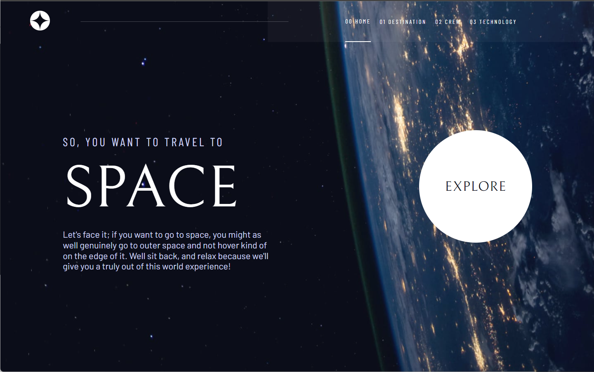
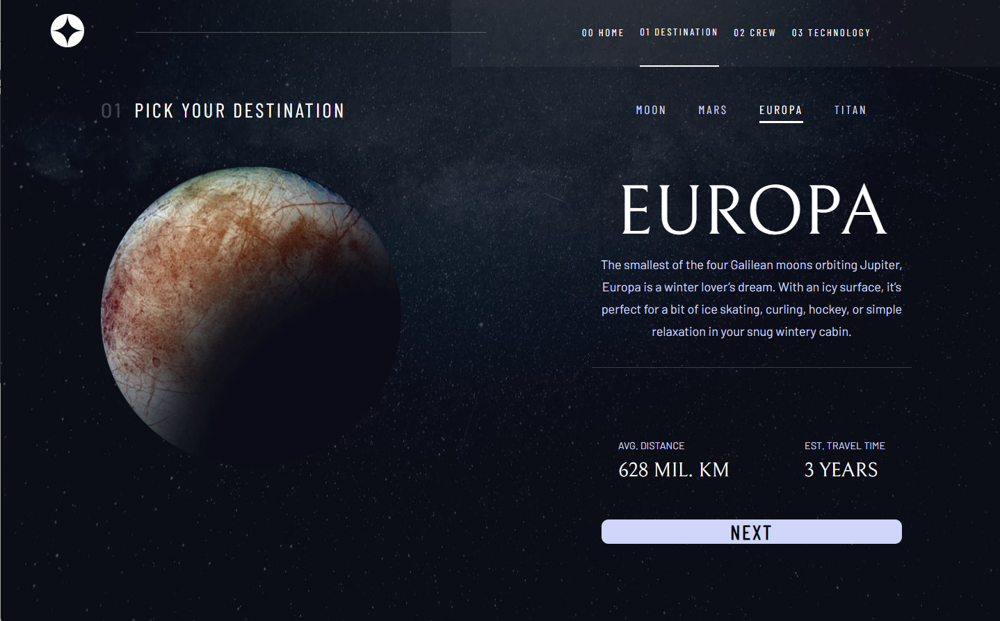
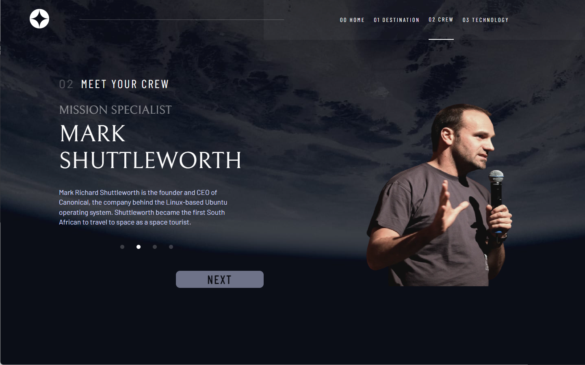
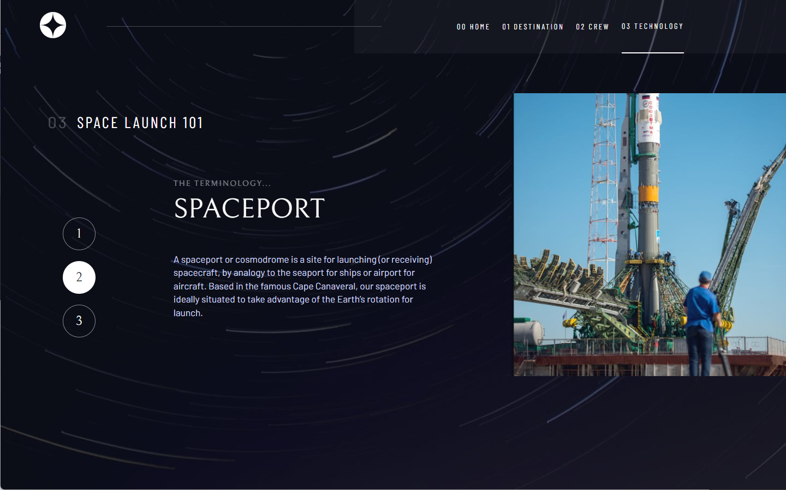

# Frontend Mentor - QR code component solution

This is a solution to the [Space tourism website challenge on Frontend Mentor](https://www.frontendmentor.io/challenges/space-tourism-multipage-website-gRWj1URZ3). Frontend Mentor challenges help you improve your coding skills by building realistic projects. 

## Table of contents

- [Overview](#overview)
  - [Screenshot](#screenshot)
  - [Links](#links)
- [My process](#my-process)
  - [Built with](#built-with)
  - [What I learned](#what-i-learned)
  - [Continued development](#continued-development)
- [Author](#author)
- [Acknowledgments](#acknowledgments)

## Overview

### Screenshot
- Desktop view

- Mobile View

- Mobile View

### Links

- Solution URL: https://github.com/mrxshinji/sunnyside-landing-page
- Live Site URL: https://mrxshinji.github.io/sunnyside-landing-page

## My process

### Built with

- Semantic HTML5 markup
- Flexbox
- Mobile-first workflow
- [React](https://reactjs.org/) - JS library

### What I learned

- First time building multiple page using React and its React Routes specialty. Building this few pages took me alot more time then I thought to add in all the animation I wanted to.
- Also first time splitting so pages into different component with its own css. Not sure is it normal to have 200 line + css per component or not...

### Continued development

- Animation with React 
- Multiple page with React

## Author

- Github - [https://github.com/mrxshinji]
- Frontend Mentor - [@mrxshinji](https://www.frontendmentor.io/profile/mrxshinji)

## Acknowledgments

-- Frontend Mentor for this project and awesome figma sketch~